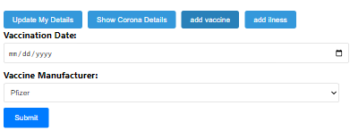

corona system overview:
This service includes
server side:
1. DB containing data about members, vaccine, patients
2. api requests to create/update/delete/get member in DB
3. api requests to create/get member in vaccine DB
4. api requests to create/get/update member in patients DB
client side:
1.On the main page, a display of the list of members, first name and last name,
each member has:
  *  link to the member's details by calling FETCH GET type to the server and navigates to the member`s details page 
  *  button to delete a member by calling FETCH DELETE type to the server
  and button to add a member that navigate to the add member page


2. On the add member page there is a form to fill in the member's information and add it to the system by calling FETCH  POST type to the server
Installation


3. On the user details page, all user data is displayed with an option to update by calling PUT FETCH to the server
User details, adding corona details by calling POST to the server
By calling UPDATE and updating the date of illness


add vaccine:



add illness:


Make sure that you have mySQL,node.js,visual studio code, installed in your computer. if not download it here

Clone the repository

Open the project in visual studio code, and do the following:
Open the server folder and run from the folder and run the node index.js command:
Open the client folder and run from the folder the following commands:
npm i 
npm start

Create a database with name corona
Run the following commands in your mySQL:
```
# createing the members tabel:
    CREATE TABLE members (
        ID int AUTO_INCREMENT PRIMARY KEY,
        FirstName varchar(50),
        LastName varchar(50),
        IDNumber varchar(50),
        AddressCity varchar(50),
        AddressStreet varchar(50),
        AddressNumber varchar(10),
        BirthDate date,
        Phone varchar(20),
        MobilePhone varchar(20)
    );

# creating the patients table:

    CREATE TABLE patients (
    PatientID int AUTO_INCREMENT PRIMARY KEY,
    MemberID int,
    PositiveTestDate date,
    RecoveryDate date,
    FOREIGN KEY (MemberID) REFERENCES members(ID)
);

# creating the vaccniated table:

    CREATE TABLE vaccinated (
    VaccinatedID int AUTO_INCREMENT PRIMARY KEY,
    MemberID int,
    VaccinationDate date,
    VaccineManufacturer varchar(50),
    FOREIGN KEY (MemberID) REFERENCES members(ID)
);
```

now you can open your browser in http://localhost:3000/ and try the system enjoy:)


